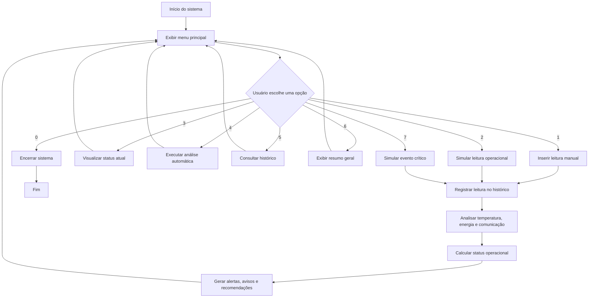

# Mission Control IA — Terminal de Monitoramento Operacional

Sistema em Python para monitoramento operacional de uma missão espacial experimental em terminal.

O projeto permite registrar leituras da missão, simular eventos operacionais, executar análises automáticas, gerar alertas e manter um histórico de leituras usando estruturas fundamentais de programação.

---

## Informações do projeto

**Missão:** Artemis Deep Scan

---

## Integrantes

* Caio César Portela França — RM: 573127
* Gustavo Curis de Francisco — RM: 569704
* Tiago Pimentel Muniz — RM: 574148

---

## Objetivo

Desenvolver um sistema simples de monitoramento de missão espacial em terminal, aplicando conceitos de:

* estruturas condicionais;
* laços de repetição;
* listas;
* dicionários;
* funções;
* organização de histórico;
* análise automática de dados;
* tomada de decisão baseada em regras.

O sistema monitora temperatura, energia e comunicação. A partir desses dados, calcula automaticamente o status operacional da missão, identificando situações normais, de atenção e críticas.

---

## Funcionalidades

O sistema permite:

* inserir nova leitura manual;
* simular leitura operacional;
* visualizar o status atual da missão;
* executar análise automática da última leitura;
* consultar histórico de leituras;
* exibir resumo geral da missão;
* simular evento crítico;
* encerrar o sistema com segurança.

---

## Parâmetros monitorados

| Parâmetro          | Descrição                                                                         |
| ------------------ | --------------------------------------------------------------------------------- |
| Temperatura        | Temperatura atual da nave em graus Celsius                                        |
| Energia            | Percentual de energia disponível                                                  |
| Comunicação        | Indica se a comunicação está ativa ou em falha                                    |
| Status operacional | Resultado calculado automaticamente pelo sistema com base nas condições da missão |

---

## Regras de análise

O sistema analisa cada leitura com base em regras simples.

### Temperatura

| Condição                        | Resultado                    |
| ------------------------------- | ---------------------------- |
| Temperatura acima de 80 °C      | Alerta de superaquecimento   |
| Temperatura entre 70 °C e 80 °C | Aviso de temperatura elevada |
| Temperatura abaixo de 70 °C     | Sem alerta térmico           |

### Energia

| Condição                | Resultado                   |
| ----------------------- | --------------------------- |
| Energia abaixo de 20%   | Energia em nível crítico    |
| Energia entre 20% e 30% | Reserva energética reduzida |
| Energia acima de 30%    | Energia aceitável           |

### Comunicação

| Condição        | Resultado            |
| --------------- | -------------------- |
| Comunicação = 1 | Comunicação ativa    |
| Comunicação = 0 | Falha de comunicação |

---

## Classificação da leitura

Cada leitura recebe um status operacional calculado automaticamente.

| Status operacional | Critério                                  |
| ------------------ | ----------------------------------------- |
| NORMAL             | Nenhum alerta ou aviso identificado       |
| ATENÇÃO            | Existem avisos, mas nenhuma falha crítica |
| CRÍTICO            | Existe pelo menos um alerta crítico       |

---

## Estrutura de dados utilizada

O sistema utiliza uma lista principal chamada `historico_leituras`.

Cada leitura registrada é armazenada como um dicionário dentro dessa lista.

Exemplo simplificado:

```python
historico_leituras = [
    {
        "numero": 1,
        "temperatura": 24.0,
        "energia": 92.0,
        "comunicacao": 1,
        "status_operacional": "NORMAL"
    }
]
```

Essa estrutura permite:

* armazenar múltiplas leituras;
* consultar o histórico completo;
* calcular resumo geral;
* contar leituras normais, em atenção e críticas;
* calcular médias de temperatura e energia.

---

## Fluxograma do sistema



---

## Explicação da lógica utilizada

O sistema funciona com um menu principal em repetição.

Enquanto o usuário não escolhe a opção de encerrar, o programa continua exibindo opções e executando as ações selecionadas.

A lógica principal segue este fluxo:

1. O usuário escolhe uma opção no menu.
2. O sistema registra ou consulta dados conforme a opção selecionada.
3. Quando uma nova leitura é registrada, ela passa pela função de análise.
4. A função de análise verifica temperatura, energia e comunicação.
5. O sistema calcula automaticamente o status operacional da missão.
6. O sistema gera alertas, avisos e recomendações.
7. A leitura analisada é armazenada no histórico.
8. O usuário pode consultar a última leitura, executar análise ou visualizar o histórico completo.

A análise automática utiliza condicionais para identificar situações de risco.

O histórico utiliza uma lista de dicionários, permitindo armazenar várias leituras durante a execução do programa.

---

## Demonstração do sistema

Os prints abaixo mostram o sistema funcionando no terminal.

### Menu principal


### Inserção de leitura manual


### Análise automática


### Histórico de leituras


### Evento crítico simulado


### Resumo geral da missão


---

## Tecnologias utilizadas

* Python
* Terminal
* Listas
* Dicionários
* Funções
* Condicionais
* Laços de repetição
* Entrada de dados pelo usuário
* Histórico em memória

---

## Cenários demonstrados

O sistema demonstra:

* uma missão em condição normal;
* uma missão em estado de atenção;
* uma missão em estado crítico;
* falha de comunicação;
* superaquecimento;
* energia em nível crítico;
* cálculo automático do status operacional;
* recomendações automáticas;
* histórico operacional.

---

## Observação

O Mission Control IA — Terminal de Monitoramento Operacional é uma simulação acadêmica. Os dados utilizados são simulados e servem para demonstrar como estruturas básicas de programação podem ser aplicadas no monitoramento de uma missão espacial experimental.
